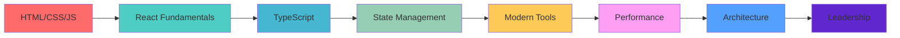

# 👋 Hey there! I'm **Zibek** (zh1kaa)

<div align="center">
  


</div>

---

## 🚀 About Me

> **Passionate Frontend Developer** with **2+ years** of hands-on experience creating modern, responsive web applications. I love turning complex problems into simple, beautiful, and intuitive solutions.

```javascript
const zh1kaa = {
  name: "Zibek",
  role: "Frontend Developer",
  experience: "2+ years",
  location: "🌍 Bishkek, Kyrgyzstan",
  currentFocus: ["React", "TypeScript", "Modern Web Development"],
  learning: ["Next.js 15", "Advanced React Patterns", "Web Performance"],
  passions: ["Clean Code", "UI/UX Design", "Problem Solving"],
  motto: "Code with passion, design with purpose ✨"
};
```

---

## 🛠️ **Tech Stack & Skills**

### **Frontend Mastery**
<div align="center">


</div>

### **Styling & Design**
<div align="center">


</div>

### **State & Data Management**
<div align="center">


</div>

### **Tools & Workflow**
<div align="center">


</div>

---

## 📊 **GitHub Analytics**

<div align="center">
  


</div>

<div align="center">


</div>

---

## 🎯 **Featured Projects**

### 🎮 **Pokemon Collection App**
> **Full-stack Pokemon collection and battle application**

**🔧 Tech Stack:** React 19 • TypeScript • Vite • SCSS • Zustand • React Query  
**✨ Features:** Pokemon Explorer • Personal Collection • Battle Arena • Responsive Design

```typescript
// Battle system example
const calculatePokemonPower = (pokemon: Pokemon): number => {
  return pokemon.stats.reduce((total, stat) => total + stat.base_stat, 0);
};
```

**🌟 Highlights:**
- 📱 **Responsive Design** - Works perfectly on all devices
- ⚡ **Performance Optimized** - Fast loading with efficient caching
- 🎨 **Modern UI/UX** - Beautiful animations and interactions
- 📊 **Real-time Data** - Integration with official PokeAPI

[](https://github.com/zh1kaa/pokemon-arena)
[](https://pokimon-arena.vercel.app)

---

### 🌐 **Modern Web Dashboard**
> **Enterprise-level admin dashboard with advanced features**

**🔧 Tech Stack:** Next.js • TypeScript • Tailwind CSS • Recharts  
**✨ Features:** Analytics • User Management • Real-time Updates • Dark Mode

**🌟 Highlights:**
- 📈 **Advanced Analytics** - Interactive charts and data visualization
- 🔐 **Security First** - JWT authentication and role-based access
- 🎨 **Beautiful Design** - Modern UI with smooth animations
- 📊 **Performance** - Server-side rendering for optimal speed

[](#)

---

### 🛒 **E-Commerce Platform**
> **Full-featured online shopping application**

**🔧 Tech Stack:** React • Redux • SCSS • Stripe API  
**✨ Features:** Product Catalog • Shopping Cart • Payment Integration • Order Management

**🌟 Highlights:**
- 💳 **Secure Payments** - Stripe integration for safe transactions
- 🛍️ **User Experience** - Intuitive shopping flow and checkout
- 📱 **Mobile First** - Optimized for mobile shopping experience
- 🔍 **Search & Filter** - Advanced product discovery features

[](#)

---

## 🎯 **What I'm Currently Working On**

```javascript
const currentProjects = {
  🔥 learning: [
    "Next.js 15 App Router",
    "Advanced React Patterns",
    "Web Performance Optimization",
    "Micro-frontends Architecture"
  ],
  
  🚀 building: [
    "Personal Portfolio Website",
    "Open Source Component Library",
    "Real-time Chat Application"
  ],
  
  📚 reading: [
    "Clean Architecture by Robert Martin",
    "Atomic Design Principles",
    "Advanced TypeScript Techniques"
  ]
};
```

---

## 💼 **Professional Experience**

### **Frontend Developer** | *2022 - Present*
- 🏗️ **Built 15+ responsive web applications** using React, TypeScript, and modern tools
- 📈 **Improved performance by 40%** through code optimization and lazy loading
- 🎨 **Collaborated with designers** to implement pixel-perfect UI/UX designs
- 🔧 **Mentored junior developers** in React best practices and modern workflows
- 📊 **Increased user engagement by 25%** through improved user experience

### **Key Achievements:**
- ⚡ **Performance Optimization** - Reduced bundle size by 35% using code splitting
- 🎨 **UI Component Library** - Created reusable component system used across 5+ projects
- 📱 **Mobile-First Development** - Led responsive design implementation for better mobile UX
- 🔄 **CI/CD Implementation** - Set up automated testing and deployment pipelines

---

## 📈 **Activity Graph**

<div align="center">


</div>

---

## 🏆 **Achievements & Recognition**

<div align="center">


</div>

**🎯 Professional Milestones:**
- 🌟 **2+ Years** of professional frontend development
- 🚀 **15+ Projects** delivered successfully
- 👥 **Team Leadership** experience with 3+ developers
- 📊 **40% Performance** improvement in applications
- 🎨 **5+ UI Libraries** created and maintained

---

## 📚 **Learning Journey**



---

## 🤝 **Let's Connect & Collaborate**

<div align="center">

[](https://linkedin.com/in/zh1kaa)
[](https://zh1kaa.dev)
[](mailto:zh1kaa.dev@gmail.com)
[](https://t.me/zh1kaa)

</div>

---

## 💡 **Fun Facts About Me**

```typescript
const funFacts = {
  🎮 hobbies: ["Gaming", "Photography", "Mountain Hiking"],
  ☕ fuel: "Coffee (lots of it!)",
  🎵 codingMusic: ["Lo-fi Hip Hop", "Electronic", "Ambient"],
  🌱 philosophy: "Learn something new every day",
  🎯 goal2024: "Master Next.js & contribute to open source",
  🌟 motto: "Clean code is not written by following a set of rules. Clean code is written by someone who cares."
};
```

---

<div align="center">

### 🌟 **"Code is like humor. When you have to explain it, it's bad."** 

**Thanks for visiting my profile!** ⭐ *Star some repositories if you find them interesting!*


---

*Last updated: January 2025* 🚀

</div>
